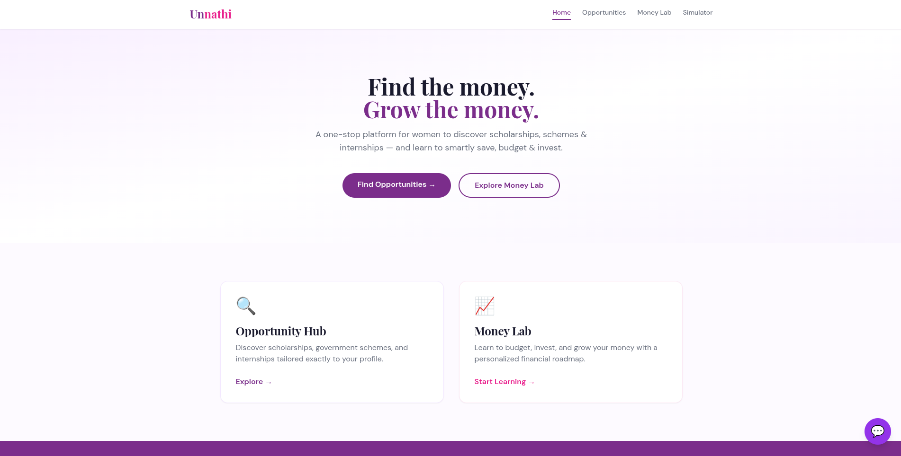
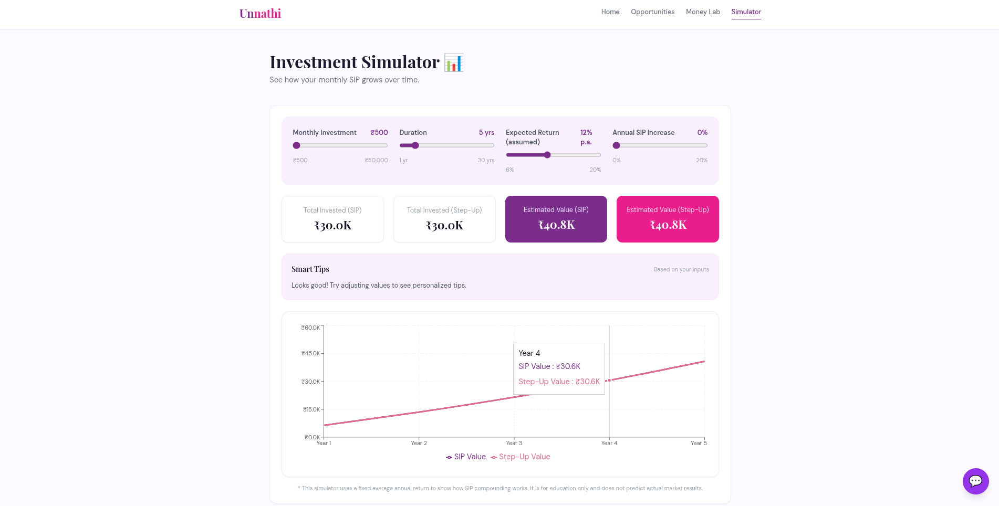

# Unnathi

Unnathi is a platform designed to help women discover scholarships, internships, and government schemes while building financial literacy through interactive learning resources, an investment simulator, and an AI-powered assistant.

> Built as part of **Her-a-thon 2026**, a women's hackathon conducted by the **Finite Loop Womens Community (FLWC), NMAM Institute of Technology**.

## Live Demo

Website: https://unnathi-sage.vercel.app/

## Features

* Scholarship discovery and filtering
* Government schemes for women
* Internship opportunities
* Financial learning through Money Lab
* SIP and Step-Up SIP Investment Simulator
* AI-powered HerBot assistant
* Financial milestones tracker
* Personal finance quiz
* Responsive user interface

## Tech Stack

<p>
  
  
  
  
  
  
  
</p>

## Project Structure

```text
Unnathi
├── Docs.md
├── README.md
├── src
│   ├── components
│   │   ├── ChatBot.jsx
│   │   ├── FilterBar.jsx
│   │   ├── Footer.jsx
│   │   ├── InvestmentSimulator.jsx
│   │   ├── Navbar.jsx
│   │   ├── SchemeCard.jsx
│   │   └── ScholarshipCard.jsx
│   ├── firebase
│   │   └── config.js
│   ├── images
│   ├── pages
│   │   ├── Home.jsx
│   │   ├── MoneyLab.jsx
│   │   ├── OpportunityHub.jsx
│   │   └── Simulator.jsx
│   └── services
│       └── db.js
├── package.json
├── tailwind.config.js
└── vite.config.js
```

## Running the Project Locally

Clone the repository:

```bash
git clone <repository-url>
cd Unnathi
```

Install dependencies:

```bash
npm install
```

Create a `.env` file and add your API key:

```env
VITE_OPENROUTER_API_KEY=your_api_key
```

Start the development server:

```bash
npm run dev
```

Open:

```text
http://localhost:5173
```

## Running Tests

No automated tests are currently configured for this project.

## Application Modules

### Opportunity Hub

Browse scholarships, government schemes, and internship opportunities. Users can filter opportunities based on state, course, and category.

### Money Lab

Provides beginner-friendly financial education covering budgeting, saving, investing, SIPs, emergency funds, and financial planning.

### Investment Simulator

Interactive SIP calculator that visualizes investment growth over time and compares regular SIPs with Step-Up SIPs.

### HerBot

AI-powered chatbot that assists users with:

* Scholarships
* Government schemes
* Internships
* Career guidance
* Personal finance queries

## Screenshots

### Home



### Opportunities and HerBot


### Money Lab


### Investment Basics


### Investment Simulator



## Contributors

* Atmika Nayak
* Shreya G Amin
* Ishta P Jain
* Aakanksha K Poojari

## Additional Notes

* Firebase Firestore is used for storing scholarships, schemes, and internship data.
* The application falls back to local sample data if Firebase data is unavailable.
* Project planning, team responsibilities, and development workflow are documented in `Docs.md`.

## Resources

* Firebase: https://firebase.google.com
* React Router: https://reactrouter.com
* Recharts: https://recharts.org
* OpenRouter: https://openrouter.ai
